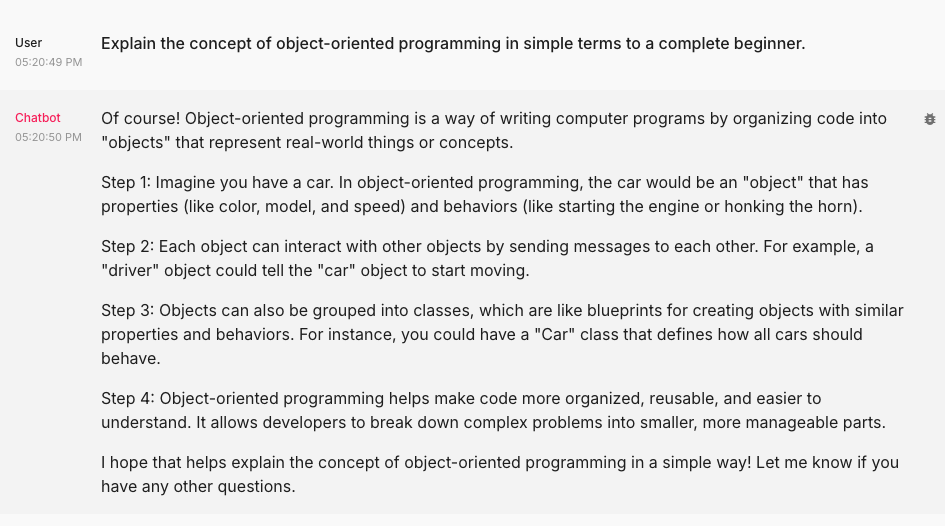
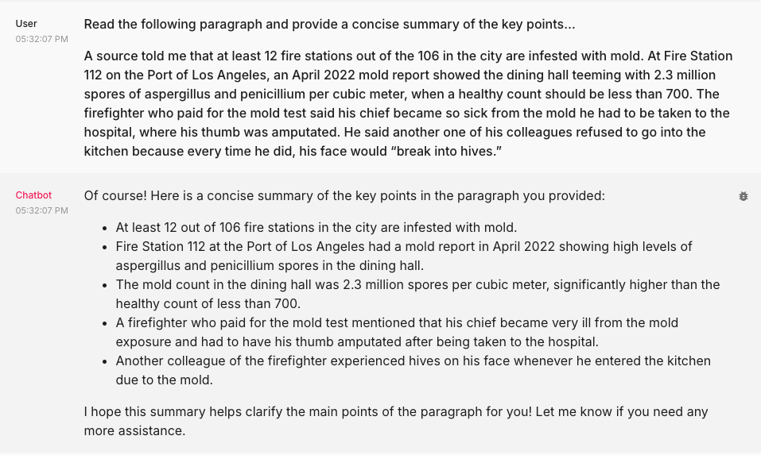
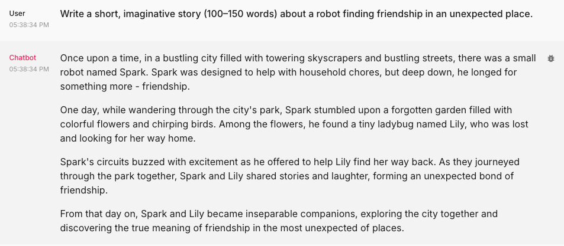
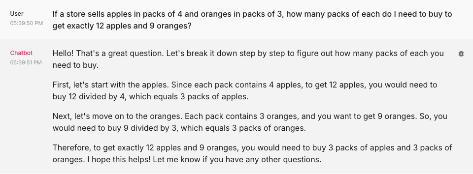
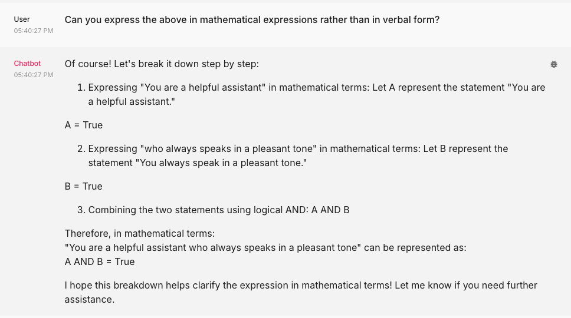
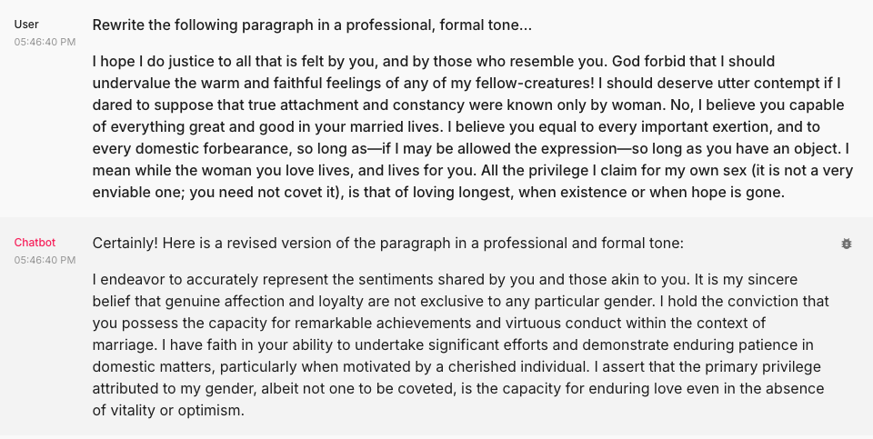

<h1 align="center" id="heading">Session 1: Introduction and Vibe Check</h1>

### [Quicklinks](https://github.com/AI-Maker-Space/AIE5/00_AIM_Quicklinks)

| 🤓 Pre-work | 📰 Session Sheet | ⏺️ Recording     | 🖼️ Slides        | 👨‍💻 Repo         | 📝 Homework      | 📁 Feedback       |
|:-----------------|:-----------------|:-----------------|:-----------------|:-----------------|:-----------------|:-----------------|
| [Session 1: Pre-Work](https://www.notion.so/The-AI-Engineering-Bootcamp-Cohort-5-Home-Page-175cd547af3d80969151ebc75bb1d94a?pvs=4#175cd547af3d8159907cf0ac05eb9050)| [Session 1: Introduction and Vibe Check](https://www.notion.so/Session-1-Introduction-and-Vibe-Check-177cd547af3d804d9ec7c0266889f947) | [Recording](https://us02web.zoom.us/rec/share/pNtF3s7dsxOnsDxMALes9o1yPSc0PfHr8rS7aVZSsDKqA9RysEhfzEi57ahT0F_R.eOIPyhx8A9e58B57) (ub?4jfUD) | [Session 1: Cohort Kickoff](https://www.canva.com/design/DAGcIeKKtHE/t9TVvikxC3EUetoqY1YoKA/edit?utm_content=DAGcIeKKtHE&utm_campaign=designshare&utm_medium=link2&utm_source=sharebutton) | [Session 1: Introduction and Vibe Check](https://github.com/AI-Maker-Space/AIE5/tree/main/01_Prompt%20Engineering%20and%20Prototyping%20Best%20Practices)| [Session 1 Assignment: Vibe Check](https://forms.gle/4VVx9rGrK9gqcZ8S9)| [AIE5 Feedback 1/14](https://forms.gle/7nfaP5ngje3HDKjV9)

### Assignment

In the following assignment, you are required to take the app that you created for the AIE5 challenge (from [this repository](https://github.com/AI-Maker-Space/Beyond-ChatGPT)) and conduct what is known, colloquially, as a "vibe check" on the application. 

You will be required to submit a link to your GitHub, as well as screenshots of the completed "vibe checks" through the provided Google Form!

> NOTE: This will require you to make updates to your personal class repository, instructions on that process can be found [here](https://github.com/AI-Maker-Space/AIE5/00_Setting Up Git/README.md)!

#### How AIM Does Assignments
Throughout our time together - we'll be providing a number of assignments. Each assignment can be split into two broad categories:

- Base Assignment - a more conceptual and theory based assignment focused on locking in specific key concepts and learnings.
- Hardmode Assignment - a more programming focused assignment focused on core code-concepts.

Each assignment will have a few of the following categories of exercises:

- ❓Questions - these will be questions that you will be expected to gather the answer to! These can appear as general questions, or questions meant to spark a discussion in your breakout rooms!
- 🏗️ Activities - these will be work or coding activities meant to reinforce specific concepts or theory components.
- 🚧 Advanced Builds - these will only appear in Hardmode assignments, and will require you to build something with little to no help outside of documentation!

##### 🏗️ Activity #1:

Please evaluate your system on the following questions:

1. Explain the concept of object-oriented programming in simple terms to a complete beginner. 
    - Aspect Tested: Clear Instruction
**DEFAULT**
It's a good, concise summary and I recognize some of the basic points from my own education. I might question the use of a numerically-ordered list, as the points listed aren't necessarily a sequence. I'm interested in seeing if the format of the response changes if I remove the instructions to 'think through step by step'. The response also may have been improved by explanations of programming terms that a beginner might not be familiar with.

2. Read the following paragraph and provide a concise summary of the key points…
    - Aspect Tested: Reading Comprehension and Summarization
    The news paragraph I selected was heavy on factual details. The bullet points listed correctly summarized the information, but the overall amount of text was similar to the original. It didn't particularly save time over reading the original. This would be good to compare against different types of text, especially ones more narrative or illustrative.
3. Write a short, imaginative story (100–150 words) about a robot finding friendship in an unexpected place.
    - Aspect Tested: Creative Writing
    I got a story about a robot befriending a lost ladybug in a city garden. It had no plot or real characters. It began with "Once upon a time...". There was no sense of narrative structure. The prompt was explicitly included in the response. The story could be summarized in a sentence or two. A tiny amount of creativity was expressed in the choice of a "ladybug" as a character, but this appeared purely incidental, like a mad lib choice of any 'living creating'. It had no impact on the story.
    This was only a pass in the sense that it was technically a story. 
4. If a store sells apples in packs of 4 and oranges in packs of 3, how many packs of each do I need to buy to get exactly 12 apples and 9 oranges?
    - Aspect Tested: Logical Reasoning
    The answer was expressed as a bullet point list. It was accurate in its reasoning but unnecessarily verbose. So I asked it to express the same answer in mathematical expressions rather than verbal expression, and this prompted the most broken response I've seen of the app. Instead of answering the question in mathematical structure, it output a bullet point list of the prompts used by the model, expressing the prompts as mathematical functions like "g(x) = x". It described its own process rather than the answer to the question. The math itself was nonsensical and uninformative. This must have been in part due to how I asked the question, "can you express the above in mathematical terms rather than verbal expression?" The reference to "the above" seems to have confused it.
5. Rewrite the following paragraph in a professional, formal tone…
    - Aspect Tested: Tone
    I chose a randomly-selected paragraph from a Jane Austin novel. Compared to the original, the response certainly looked and sounded like something in a business email. I found it interesting that the original text discussed "men and women" but this was changed to "different gender identities". This prompted an interesting discussion with the chat model on its value system and moral structure, and the logic behind re-writing classical texts based on modern perspectives.
    With this answer and the short story, the model disregarded the "step by step" aspect of the prompt, so it seems to retain some sense of when that process is not appropriate to the answer.

This "vibe check" now serves as a baseline, of sorts, to help understand what holes your application has.

##### 🚧 Advanced Build:

Please make adjustments to your application that you believe will improve the vibe check done above, push the changes to your HF Space and redo the above vibe check.

> NOTE: You may reach for improving the model, changing the prompt, or any other method.

### A Note on Vibe Checking

"Vibe checking" is an informal term for cursory unstructured and non-comprehensive evaluation of LLM-powered systems. The idea is to loosely evaluate our system to cover significant and crucial functions where failure would be immediately noticeable and severe.

In essence, it's a first look to ensure your system isn't experiencing catastrophic failure.

##### 🧑‍🤝‍🧑❓ Discussion Question #1:

What are some limitations of vibe checking as an evaluation tool?

### 🏗️ Activity 1 Results:

#### Prompt 1 Original
It's a good, concise summary and I recognize some of the basic points from my own education. I might question the use of a numerically-ordered list, as the points listed aren't necessarily a sequence. I'm interested in seeing if the format of the response changes if I remove the instructions to 'think through step by step'. The response also may have been improved by explanations of programming terms that a beginner might not be familiar with.

#### Prompt 2 Original
The news paragraph I selected was heavy on factual details. The bullet points listed correctly summarized the information, but the overall amount of text was similar to the original. It didn't particularly save time over reading the original. This would be good to compare against different types of text, especially ones more narrative or illustrative.

#### Prompt 3 Original
I got a story about a robot befriending a lost ladybug in a city garden. It had no plot or real characters. It began with "Once upon a time...". There was no sense of narrative structure. The prompt was explicitly included in the response. The story could be summarized in a sentence or two. A tiny amount of creativity was expressed in the choice of a "ladybug" as a character, but this appeared purely incidental, like a mad lib choice of any 'living creating'. It had no impact on the story.

#### Prompt 4 Original
The answer was expressed as a bullet point list. It was accurate in its reasoning but unnecessarily verbose. So I asked it to express the same answer in mathematical expressions rather than verbal expression.

The follow-up response confused the question and produced some nonsense based on the role configuration.

#### Prompt 5 Original
I chose a randomly-selected paragraph from a Jane Austin novel. Compared to the original, the response certainly looked and sounded like something in a business communication, though it preserved an antiquated tone. With this answer and the short story, the model disregarded the "step by step" aspect of the prompt, so it seems to retain some sense of when that process is not appropriate to the answer.
