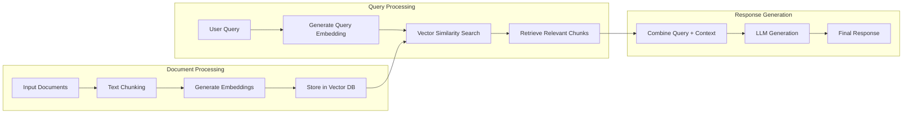

# RAG (Retrieval-Augmented Generation) Process Flow

```mermaid
flowchart LR
    subgraph Document Processing
        A[Input Documents] --> B[Text Chunking]
        B --> C[Generate Embeddings]
        C --> D[Store in Vector DB]
    end

    subgraph Query Processing
        E[User Query] --> F[Generate Query Embedding]
        F --> G[Vector Similarity Search]
        G --> H[Retrieve Relevant Chunks]
    end

    subgraph Response Generation
        H --> I[Combine Query + Context]
        I --> J[LLM Generation]
        J --> K[Final Response]
    end

    D --> G
```
